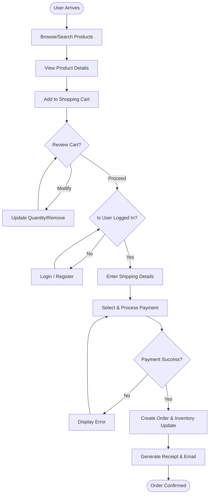
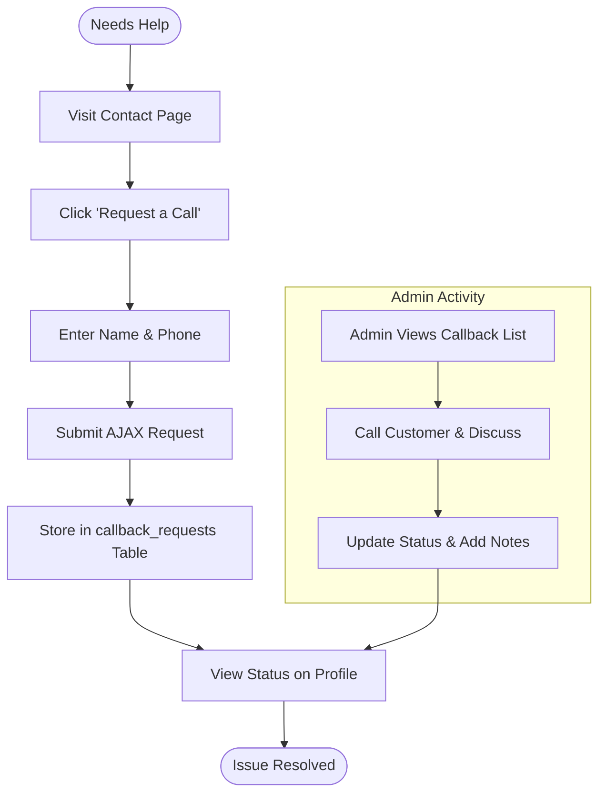

# Activity Diagrams - Craft Royale

This document illustrates the step-by-step workflow of the core processes within the Craft Royale platform.

## 1. Purchase & Checkout Workflow
This diagram follows the activity from a user arriving at the site to successfully placing an order.

---

## 2. Callback Request Workflow
This illustrates the activity flow for the support feature recently implemented.

---

## Main Activity Topics

### 1. The Sales Loop
Focuses on the conversion of a visitor into a customer by providing a seamless path through product discovery and secure checkout.

### 2. The Support Loop
Ensures that users can easily reach out for personalized assistance and track their request status, closing the loop between the customer and the admin.

---
**Note:** These diagrams use Gane-Sarson logic to represent the flow of control within the Craft Royale system.
