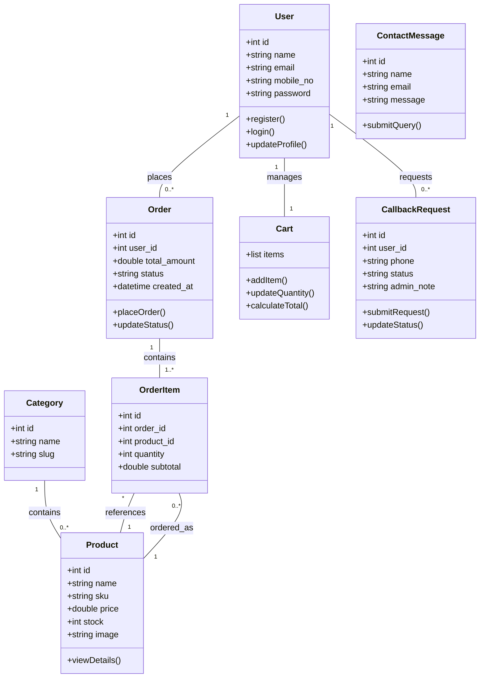

# High-Level Class Diagram - Craft Royale

This diagram represents the core logical structure and relationships between the main entities of the Craft Royale E-Commerce platform.

---

## Core Logical Entities

### 1. User & Account
Handles identity and profile management. Users are the central actors who interact with orders and support features.

### 2. Product & Catalog
Organizes the items for sale. Products are categorized into groups to help users discover them easily.

### 3. Order & Transactions
Manages the purchase flow. An **Order** acts as a container for multiple **OrderItems**, representing a finalized transaction between the user and the store.

### 4. Communication (Support)
Includes **CallbackRequest** and **ContactMessage**. These classes manage the interaction between users and administrators for help and guidance.

---
**Note:** This is a conceptual class diagram focusing on the main system topics for architectural clarity.
