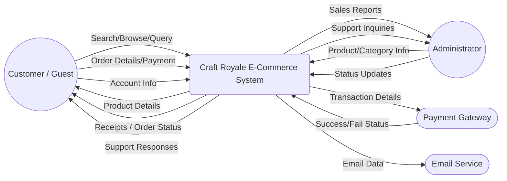
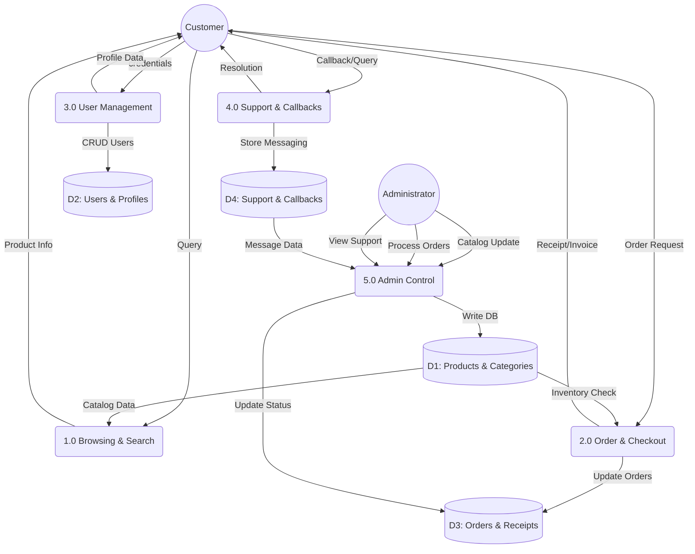

# Data Flow Diagram (DFD) - Craft Royale

This document provides a high-level view of how information moves through the Craft Royale platform at different abstraction levels.

## Level 0: Context Diagram
The context diagram shows the entire system as a single process and its interactions with external entities.

---

## Level 1: Functional DFD
The Level 1 DFD breaks down the main system into its primary processes and core data stores.

---

## Main Data Flow Topics

### 1. Catalog Flow (P1 & P5)
Manages how product data is added by admins (D1) and retrieved by customers for browsing.

### 2. Transaction Flow (P2)
Handles the critical path from cart to order creation (D3), involving inventory checks and receipt generation.

### 3. Identity Flow (P3)
The movement of user credentials and profile updates between the user and the secure user store (D2).

### 4. Communication Flow (P4)
Manages support tickets and the callback request system, tracking communication between customers and admins (D4).

---
**Note:** This DFD follows the Gane-Sarson notation logic using Mermaid for architectural visualization.
