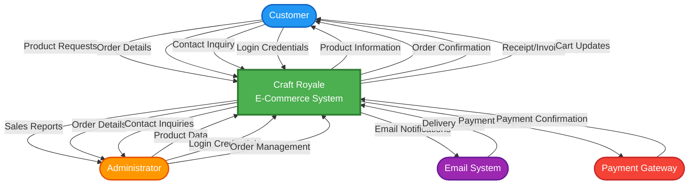
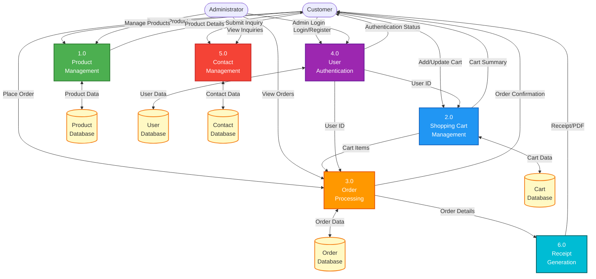
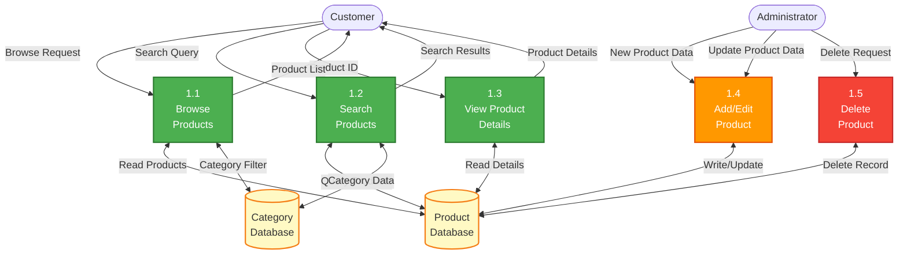
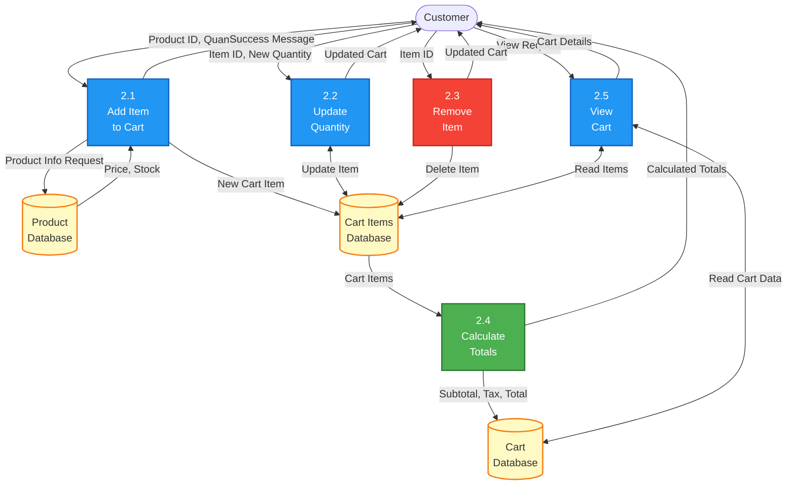
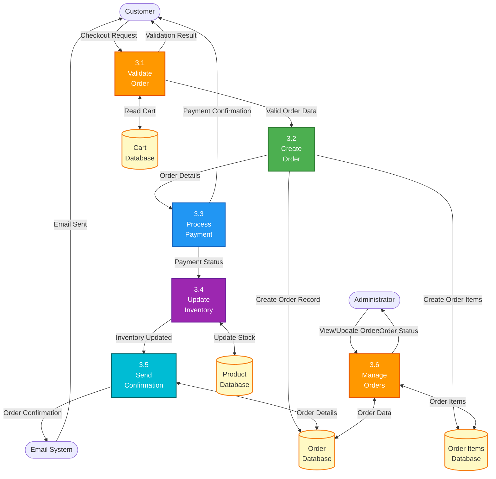
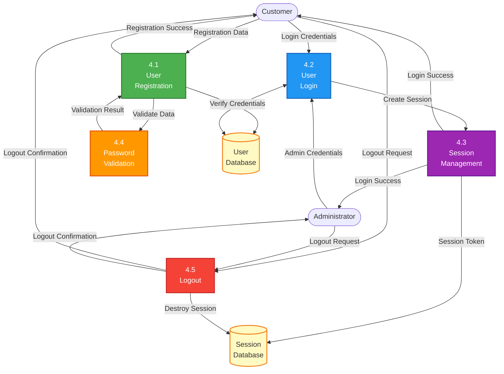
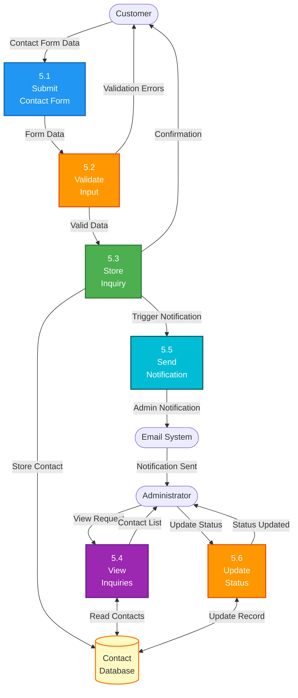
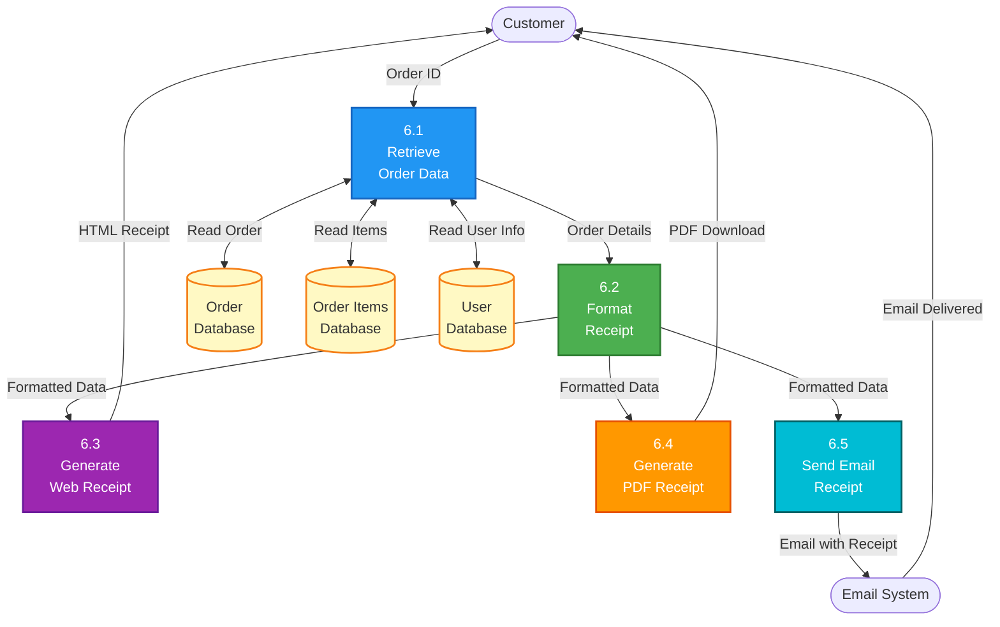

# Data Flow Diagrams (DFD) - Craft Royale E-Commerce Platform

## Context Diagram (Level 0 DFD)

The context diagram shows the entire system as a single process with external entities.

---

## Level 1 DFD

The Level 1 DFD breaks down the system into major processes.

---

## Level 2 DFD - Product Management (Process 1.0)

---

## Level 2 DFD - Shopping Cart Management (Process 2.0)

---

## Level 2 DFD - Order Processing (Process 3.0)

---

## Level 2 DFD - User Authentication (Process 4.0)

---

## Level 2 DFD - Contact Management (Process 5.0)

---

## Level 2 DFD - Receipt Generation (Process 6.0)

---

## Data Store Details

| Data Store | Description | Key Fields |
|------------|-------------|------------|
| D1 - Product Database | Stores all product information | product_id, name, description, price, image_url, stock_quantity, category |
| D2 - Cart Database | Stores shopping cart summary | cart_id, user_id, subtotal, tax, total, updated_at |
| D3 - Order Database | Stores order information | order_id, user_id, order_date, total_amount, status, shipping_address |
| D4 - User Database | Stores user account information | user_id, username, email, password_hash, phone, created_at |
| D5 - Contact Database | Stores customer inquiries | contact_id, name, email, subject, message, submitted_date, status |
| D6 - Category Database | Stores product categories | category_id, category_name, description |
| D7 - Cart Items Database | Stores individual cart items | cart_item_id, cart_id, product_id, quantity, unit_price, subtotal |
| D8 - Order Items Database | Stores individual order items | order_item_id, order_id, product_id, quantity, unit_price, subtotal |
| D9 - Session Database | Stores user session data | session_id, user_id, session_token, created_at, expires_at |

---

## External Entities

| Entity | Description | Interactions |
|--------|-------------|--------------|
| Customer | End users who browse and purchase products | Browse products, manage cart, place orders, submit inquiries |
| Administrator | System admin who manages the platform | Manage products, process orders, view inquiries, generate reports |
| Email System | External email service for notifications | Send order confirmations, contact notifications, receipts |
| Payment Gateway | External payment processing service | Process payments, return transaction status |

---

## Process Summary

| Process ID | Process Name | Description |
|------------|--------------|-------------|
| 1.0 | Product Management | Handles product catalog operations including browsing, searching, and admin management |
| 2.0 | Shopping Cart Management | Manages cart operations including add, update, remove, and calculation |
| 3.0 | Order Processing | Handles order creation, payment, inventory updates, and confirmations |
| 4.0 | User Authentication | Manages user registration, login, session management, and logout |
| 5.0 | Contact Management | Handles customer inquiries and admin responses |
| 6.0 | Receipt Generation | Generates order receipts in web and PDF formats |

---

**Note:** These DFD diagrams are created using Mermaid syntax and will render as visual diagrams in Markdown viewers that support Mermaid (GitHub, GitLab, VS Code with extensions, etc.).
