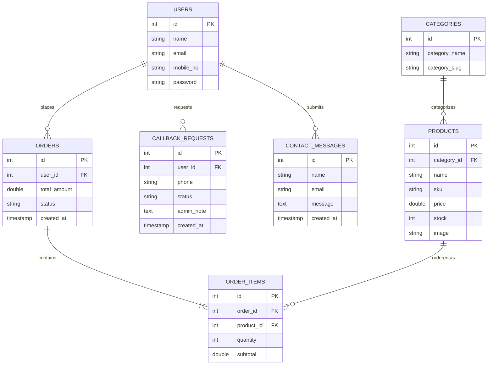

# Entity-Relationship (ER) Diagram - Craft Royale

This diagram illustrates the data models and the relationships between various entities in the Craft Royale database.

---

## Core Database Entities

### 1. Account Entities
- **USERS**: Stores profile and authentication data for customers and administrators.
- **CALLBACK_REQUESTS**: Stores phone support requests, linked to users for status tracking.

### 2. Catalog Entities
- **CATEGORIES**: High-level groupings (e.g., Embroidery, Beads).
- **PRODUCTS**: Individual inventory items linked to specific categories.

### 3. Transactional Entities
- **ORDERS**: High-level record of a purchase, including status and totals.
- **ORDER_ITEMS**: Linking table that connects products to specific orders, including quantity and price at the time of purchase.

---
**Note:** Primary Keys (PK) and Foreign Keys (FK) are indicated to show how the relational data is indexed and linked across the system.
