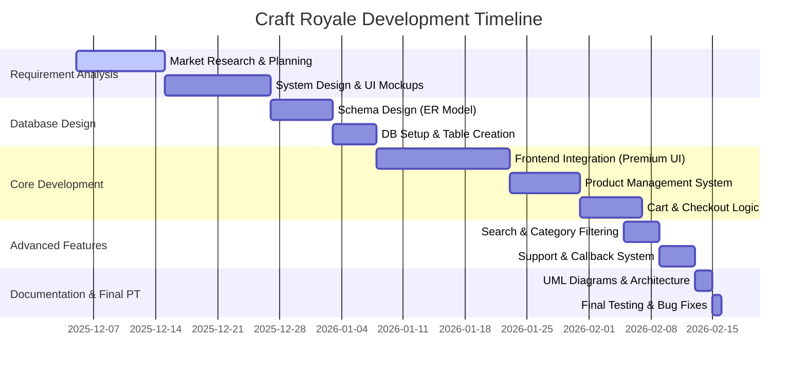

# Project Timeline - Gantt Chart (Craft Royale)

This chart illustrates the development lifecycle of the Craft Royale E-Commerce platform from inception to final completion.

---

## Project Milestones

### 1. Planning Phase (Dec 2025)
Focused on identifying the core craft supply market needs and designing a "Royale" premium aesthetic.

### 2. Infrastructure Phase (Early Jan 2026)
Establishment of the MySQL database and the core PHP routing structure.

### 3. Feature Sprint (Feb 2026)
Implementation of dynamic features like the AJAX-based search, the high-end preloader, and the user-facing callback tracking system.

### 4. Deployment & Reports (Current)
Generation of final architectural diagrams and verification of system integrity for the final university report.

---
**Note:** The timeline represents a concentrated development cycle ensuring high-quality aesthetics and robust backend functionality.
