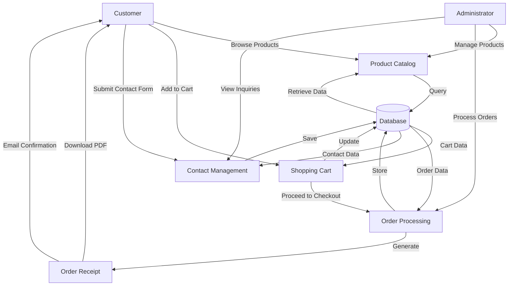
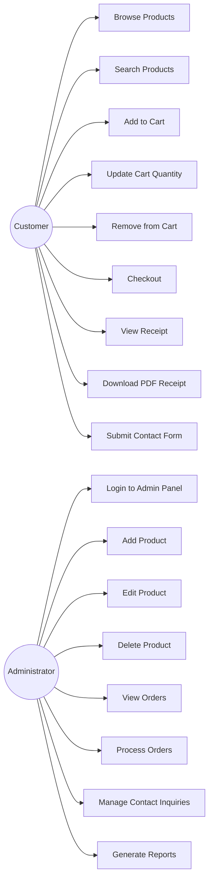
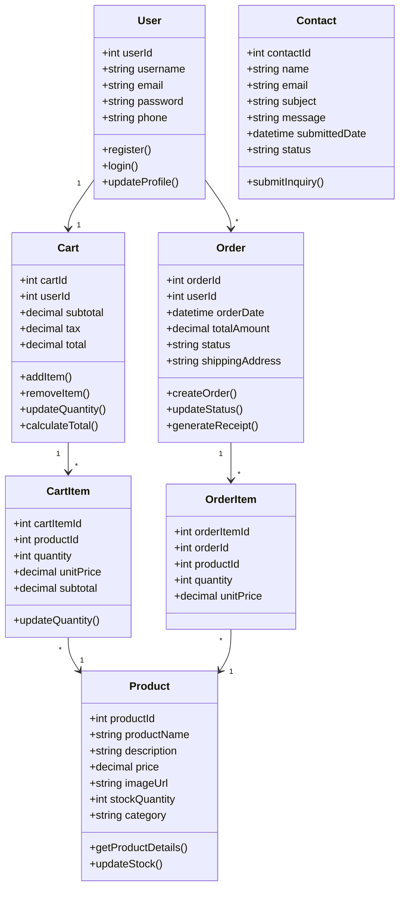
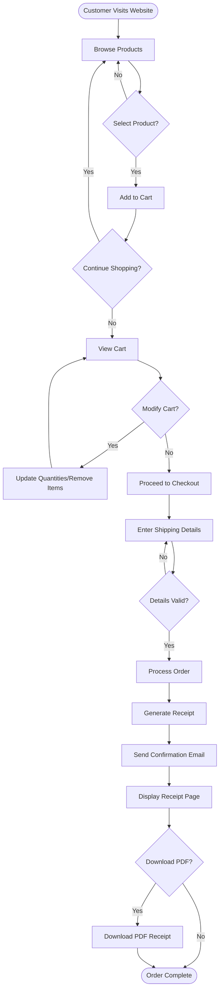
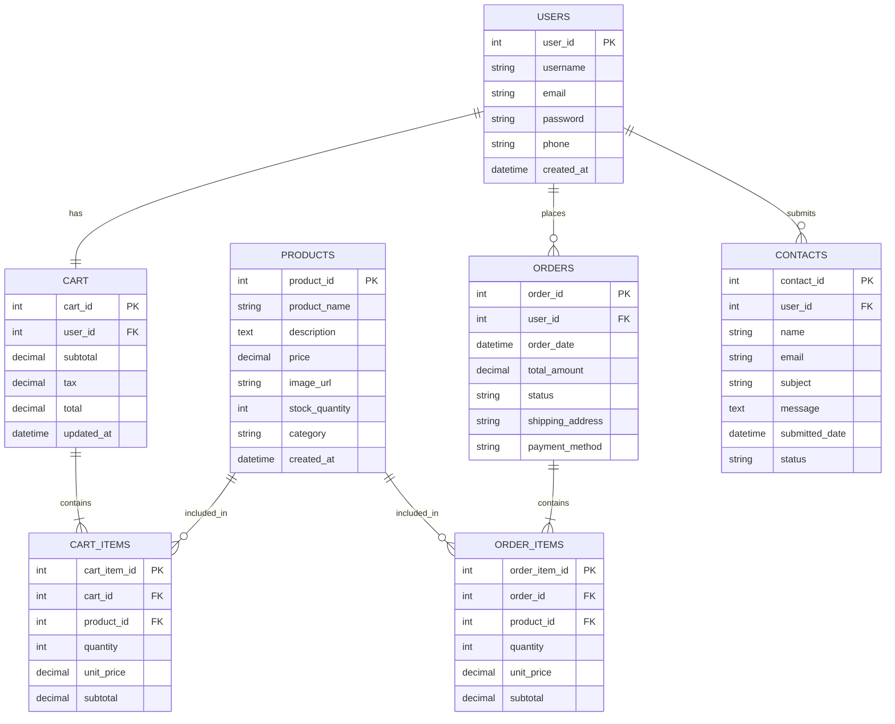
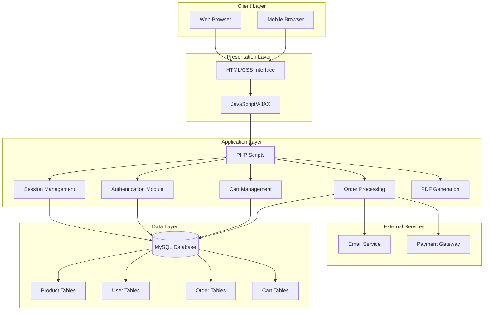

# Abstract

The rapid growth of e-commerce has transformed the way consumers purchase handmade and artisan products. Traditional brick-and-mortar craft stores face limitations in reach, operating hours, and inventory display capabilities. Craft Royale is a comprehensive web-based e-commerce platform designed to bridge the gap between artisan craftspeople and customers seeking unique, handcrafted products. This project implements a full-featured online marketplace that enables users to browse products, manage shopping carts, process orders, and communicate with administrators through integrated contact forms.

The system is developed using PHP for server-side logic, MySQL for database management, and modern web technologies including HTML5, CSS3, and JavaScript for the frontend. The platform incorporates essential e-commerce functionalities such as dynamic cart management with real-time calculations, user authentication, order processing with receipt generation, and an administrative dashboard for managing products, orders, and customer inquiries. Advanced features include dynamic shipping banners based on cart value, AJAX-powered cart updates without page refreshes, PDF receipt generation, and responsive design for mobile compatibility.

The implementation follows a modular architecture with separation of concerns, ensuring maintainability and scalability. Security measures including SQL injection prevention, session management, and input validation are integrated throughout the system. The testing phase validated all core functionalities including product browsing, cart operations, checkout processes, and administrative controls. This project demonstrates the practical application of web development principles in creating a production-ready e-commerce solution that addresses real-world business requirements while providing an intuitive user experience.

---

# Table of Contents

1. Introduction
   - 1.1 Overview
   - 1.2 Purpose and Scope
   - 1.3 Background Information
2. Problem Definition
3. Objectives of the Study
4. System Analysis
   - 4.1 Existing System
   - 4.2 Proposed System
   - 4.3 Feasibility Study
   - 4.4 Requirement Specification
5. System Design
   - 5.1 Data Flow Diagram
   - 5.2 Use Case Diagram
   - 5.3 Class Diagram
   - 5.4 Activity Diagram
   - 5.5 ER Diagram
   - 5.6 System Architecture Diagram
6. Implementation
7. Testing
8. Output Screenshots
9. Conclusion
10. Future Scope
11. Bibliography
12. Appendix

---

# Chapter 1 – Introduction

## 1.1 Overview

Craft Royale is a web-based e-commerce platform designed to facilitate the online sale and purchase of handcrafted artisan products. The system provides a comprehensive digital marketplace where craftspeople can showcase their products and customers can browse, select, and purchase items through a secure and user-friendly interface. The platform addresses the growing demand for unique, handmade products while eliminating geographical barriers that traditionally limit craft businesses.

The application implements a three-tier architecture comprising the presentation layer, business logic layer, and data access layer. Users interact with a responsive web interface that adapts to various device sizes, ensuring accessibility across desktops, tablets, and mobile devices. The system manages the complete e-commerce workflow from product discovery through checkout and order confirmation, including features such as shopping cart management, user authentication, order tracking, and administrative controls.

The platform distinguishes itself through advanced features including real-time cart calculations, dynamic shipping threshold notifications, AJAX-powered updates that eliminate page refreshes, and automated receipt generation in both web and PDF formats. Administrative functionality enables efficient management of product catalogs, order processing, and customer communication through an integrated contact management system.

## 1.2 Purpose and Scope

The primary purpose of Craft Royale is to provide artisan craftspeople with a professional online presence that expands their market reach beyond local geographical boundaries. Traditional craft businesses often struggle with limited visibility, restricted operating hours, and the overhead costs associated with physical retail spaces. This platform eliminates these barriers by providing a twenty-four-hour accessible digital storefront with unlimited virtual shelf space.

For customers, the system offers convenient access to unique handcrafted products with detailed descriptions, high-quality images, and transparent pricing. The shopping experience is enhanced through features such as persistent shopping carts, real-time inventory updates, and instant order confirmation with downloadable receipts. The scope of the project encompasses complete e-commerce functionality including product catalog management, shopping cart operations, secure checkout processes, order management, and customer service tools.

The system scope includes both customer-facing features and administrative capabilities. Customers can browse products by categories, add items to their cart, modify quantities, apply promotional codes, and complete purchases through a streamlined checkout process. Administrators access a separate dashboard for managing product listings, processing orders, responding to customer inquiries submitted through contact forms, and generating sales reports. The platform is designed to handle multiple concurrent users while maintaining data integrity and system performance.

## 1.3 Background Information

The e-commerce industry has experienced exponential growth over the past decade, with global online retail sales reaching unprecedented levels. This growth has been particularly significant in niche markets such as handcrafted and artisan products, where consumers increasingly value uniqueness, quality craftsmanship, and the story behind products. Traditional retail models have proven inadequate for small-scale craft businesses due to high overhead costs, limited market reach, and the challenges of competing with mass-produced alternatives.

From a technical perspective, modern web technologies have evolved to support sophisticated e-commerce applications that rival traditional desktop software in functionality and user experience. Server-side scripting languages like PHP provide robust frameworks for handling business logic, database interactions, and session management. Relational database management systems such as MySQL offer reliable data storage with ACID compliance, ensuring transaction integrity critical for e-commerce operations. Client-side technologies including JavaScript enable dynamic, responsive interfaces that update without full page reloads, significantly improving user experience.

The development of Craft Royale builds upon established e-commerce patterns and best practices while incorporating modern web development techniques. The system architecture follows the Model-View-Controller pattern, separating data management, business logic, and presentation concerns. Security considerations including SQL injection prevention through prepared statements, cross-site scripting mitigation, and secure session management are integrated throughout the application. The responsive design approach ensures compatibility across devices, addressing the growing trend of mobile commerce where a significant percentage of online shopping occurs on smartphones and tablets.

---

# Chapter 2 – Problem Definition

The traditional retail model for handcrafted and artisan products presents significant challenges for both sellers and buyers. Small-scale craftspeople and artisans typically rely on local craft fairs, farmers markets, and physical storefronts to sell their products. These channels impose severe limitations on business growth and sustainability. Geographic constraints restrict the customer base to local populations, while operating hours limit sales opportunities to specific times and days. The overhead costs associated with physical retail spaces, including rent, utilities, and staffing, often prove prohibitive for small businesses operating on narrow profit margins.

From the customer perspective, discovering and purchasing unique handcrafted items requires significant time and effort. Consumers must physically visit multiple locations, often during limited hours, to browse available products. The selection is restricted to whatever inventory is physically present, and comparing products across different artisans becomes impractical. There is no convenient way to research products, read reviews, or make informed purchasing decisions outside of direct interaction with sellers. This friction in the buying process results in lost sales opportunities and customer dissatisfaction.

Existing online marketplace platforms such as general e-commerce sites do not adequately serve the craft market segment. Generic platforms lack specialized features that highlight the artisan nature of products, the stories behind creations, and the personal connection between makers and buyers. Commission structures on large marketplaces can be prohibitively expensive for small-scale sellers. Additionally, craftspeople have limited control over branding, customer relationships, and the overall shopping experience when selling through third-party platforms.

The absence of a dedicated, feature-rich platform specifically designed for the craft market creates inefficiencies throughout the value chain. Artisans struggle to reach their target audience, manage inventory effectively, and process orders efficiently. Customers face difficulties discovering quality handcrafted products and completing purchases conveniently. There is a clear need for a technical solution that addresses these challenges by providing a specialized e-commerce platform tailored to the unique requirements of the craft market, offering both sellers and buyers a superior experience compared to traditional retail channels and generic online marketplaces.

---

# Chapter 3 – Objectives of the Study

The primary objectives of developing the Craft Royale e-commerce platform are as follows:

- **To develop a comprehensive web-based e-commerce platform** specifically designed for handcrafted and artisan products, providing craftspeople with a professional online presence that extends their market reach beyond geographical limitations while maintaining low operational overhead compared to physical retail spaces.

- **To implement an intuitive and responsive user interface** that enables customers to browse product catalogs, view detailed product information with high-quality images, and navigate the shopping experience seamlessly across desktop, tablet, and mobile devices, ensuring accessibility and usability for diverse user demographics.

- **To create a robust shopping cart management system** with real-time calculations of subtotals, taxes, and shipping costs, featuring dynamic updates without page refreshes, persistent cart storage across sessions, and intelligent features such as free shipping threshold notifications to encourage larger purchases and improve conversion rates.

- **To establish secure user authentication and session management** mechanisms that protect customer data, maintain shopping cart persistence across sessions, and provide personalized experiences while implementing industry-standard security practices to prevent unauthorized access and data breaches.

- **To design and implement a complete order processing workflow** that guides customers from cart review through checkout, payment information collection, order confirmation, and receipt generation, with automated email notifications and downloadable PDF receipts providing professional documentation of transactions.

- **To develop an administrative dashboard** that empowers business owners to manage product catalogs efficiently, process and track orders, respond to customer inquiries submitted through integrated contact forms, and access sales analytics, all through a centralized interface that requires no technical expertise to operate.

- **To ensure data integrity and system reliability** through proper database design with normalized schemas, implementation of ACID-compliant transactions for order processing, comprehensive error handling throughout the application, and validation of all user inputs to prevent data corruption and security vulnerabilities.

- **To optimize system performance** for handling multiple concurrent users, implementing efficient database queries, minimizing page load times through optimized asset delivery, and utilizing AJAX technology for partial page updates that reduce server load and improve perceived responsiveness.

---

# Chapter 4 – System Analysis

## 4.1 Existing System

The existing system for craft product sales primarily relies on traditional retail methods including physical storefronts, craft fairs, and farmers markets. Artisans display their products in temporary or permanent physical locations where customers can browse and make purchases in person. Some craftspeople maintain basic websites with product galleries and contact information, but these typically lack integrated e-commerce functionality, requiring customers to contact sellers directly via email or phone to place orders.

The working method involves manual inventory management using spreadsheets or paper records, in-person transactions with cash or card readers, and manual order fulfillment processes. When online sales occur through email or phone orders, sellers manually calculate totals, process payments through separate systems, and maintain order records in disconnected databases or documents. Customer relationship management is informal, relying on personal memory or basic contact lists without systematic tracking of purchase history or preferences.

The limitations of the existing system are substantial and multifaceted. Geographic restrictions severely limit the potential customer base to those who can physically visit sales locations. Operating hours constrain sales opportunities to specific times, eliminating the possibility of twenty-four-hour availability. Inventory display is limited by physical space, preventing comprehensive showcasing of all available products. The manual nature of order processing introduces opportunities for errors in pricing calculations, inventory tracking, and order fulfillment. Scaling the business requires proportional increases in physical space and staffing, creating significant barriers to growth.

Risks and inefficiencies include lost sales due to limited accessibility, customer frustration from inconvenient purchasing processes, inventory discrepancies from manual tracking, and the inability to analyze sales data for business insights. The lack of integrated systems means that sellers must duplicate effort across multiple platforms and tools, increasing workload and the potential for mistakes. Customer service suffers from the absence of order history and automated communication tools.

## 4.2 Proposed System

The proposed Craft Royale system is a fully integrated web-based e-commerce platform that automates and streamlines the entire sales process from product discovery through order fulfillment. The system provides a centralized database that maintains product catalogs, customer information, shopping carts, and order history with complete data integrity. All business operations are accessible through web interfaces that require only a browser, eliminating the need for specialized software or hardware.

The system workflow begins when customers access the platform through any web browser on any device. They browse products organized by categories, view detailed product pages with descriptions and images, and add desired items to their shopping cart. The cart dynamically calculates totals including applicable taxes and shipping costs, displaying real-time updates as quantities change. Customers proceed through a streamlined checkout process that collects shipping and payment information, validates inputs, and generates order confirmations with unique order numbers. Automated email notifications inform customers of order status, and downloadable PDF receipts provide professional transaction documentation.

Administrative workflow operates through a separate dashboard accessible only to authorized users. Administrators add new products by uploading images and entering details through web forms that validate inputs and update the database. Order management interfaces display pending and completed orders with customer details and order contents. Contact form submissions from customers appear in a management interface where administrators can review inquiries and respond appropriately. All administrative functions include appropriate access controls and audit logging.

The advantages of the proposed system are comprehensive. Twenty-four-hour accessibility eliminates time constraints on sales opportunities. Global reach removes geographic limitations, potentially expanding the customer base exponentially. Automated calculations eliminate pricing errors and ensure consistency. Real-time inventory tracking prevents overselling and provides accurate stock information. Customer data collection enables personalized marketing and relationship management. Analytics capabilities provide insights into sales trends, popular products, and customer behavior. The system scales efficiently, handling increased traffic and sales volume without proportional increases in operational overhead.

## 4.3 Feasibility Study

### Technical Feasibility

The technical feasibility of Craft Royale is highly favorable based on the maturity and availability of required technologies. The system is built using PHP, a widely adopted server-side scripting language with extensive documentation, community support, and proven capability for e-commerce applications. MySQL provides robust relational database management with ACID compliance, ensuring data integrity for critical e-commerce transactions. These technologies are open-source and freely available, reducing licensing costs to zero.

The development team possesses the necessary skills in PHP programming, MySQL database design, HTML/CSS for frontend development, and JavaScript for client-side interactivity. The XAMPP development environment provides an integrated stack including Apache web server, PHP interpreter, and MySQL database, simplifying the development and testing process. All required libraries and frameworks are readily available, including FPDF for PDF generation and standard JavaScript libraries for AJAX functionality.

Hosting requirements are modest and widely available. The application runs on standard LAMP (Linux, Apache, MySQL, PHP) stack servers offered by virtually all web hosting providers at affordable prices. No specialized hardware or proprietary software is required. The system architecture is designed for deployment on shared hosting environments, making it accessible even for small businesses with limited budgets. Technical feasibility is therefore confirmed as highly achievable with available resources and technologies.

### Economic Feasibility

The economic feasibility analysis demonstrates that Craft Royale represents a cost-effective solution with favorable return on investment potential. Development costs are minimized through the use of open-source technologies that require no licensing fees. The primary cost component is developer time for implementation and testing, which is a one-time investment. Ongoing operational costs include web hosting fees, which typically range from minimal amounts per month for shared hosting to moderate amounts for dedicated servers as the business scales.

For craft businesses, the platform eliminates or significantly reduces costs associated with physical retail spaces, including rent, utilities, and staffing. The automation of order processing, inventory management, and customer communication reduces labor requirements compared to manual systems. The ability to reach a global customer base without additional physical infrastructure provides revenue growth potential that far exceeds the modest operational costs of the web platform.

Return on investment is achievable through increased sales volume enabled by twenty-four-hour availability and expanded geographic reach. Even modest increases in monthly sales quickly offset the development and operational costs. The system's scalability means that it can support business growth without proportional cost increases, improving profitability as sales volume expands. Economic feasibility is therefore strongly positive, with low initial investment, minimal ongoing costs, and significant revenue potential.

### Operational Feasibility

Operational feasibility examines whether the system can be effectively used by its intended users and integrated into business operations. The Craft Royale platform is designed with user-friendliness as a core principle. The customer-facing interface follows familiar e-commerce conventions, requiring no training or technical knowledge. Users who have shopped on any major e-commerce platform will find the interface intuitive and easy to navigate.

The administrative interface is designed for business owners who may have limited technical expertise. Product management, order processing, and customer inquiry handling are accomplished through simple web forms with clear labels and instructions. No knowledge of databases, programming, or server administration is required to operate the system. The learning curve is minimal, with most users becoming proficient within hours of initial use.

Integration into existing business operations is straightforward. The system can coexist with traditional sales channels, serving as an additional revenue stream rather than requiring complete business transformation. Inventory can be managed to reflect products available across all channels, or the online platform can feature exclusive items. The flexibility of the system allows businesses to adopt it at their own pace and integrate it into their operations in ways that best suit their specific needs. Operational feasibility is therefore confirmed as highly achievable with minimal disruption to existing business processes.

## 4.4 Requirement Specification

### Hardware Requirements

| Component | Specification | Purpose |
|-----------|--------------|---------|
| Processor | Intel Core i3 or equivalent | Sufficient processing power for development and testing |
| RAM | 4 GB minimum, 8 GB recommended | Adequate memory for running development environment and database |
| Hard Disk | 20 GB free space minimum | Storage for application files, database, and development tools |
| Network Interface | Ethernet or Wi-Fi adapter | Internet connectivity for testing and deployment |
| Display | 1366x768 resolution minimum | Adequate screen space for development tools and testing |

### Software Requirements

| Component | Specification | Purpose |
|-----------|--------------|---------|
| Operating System | Windows 10/11, Linux, or macOS | Platform for running development environment |
| Web Server | Apache 2.4 or higher | Serves web pages and processes PHP scripts |
| PHP | Version 7.4 or higher | Server-side scripting language for business logic |
| MySQL | Version 5.7 or higher | Relational database management system |
| Web Browser | Chrome, Firefox, Safari, or Edge (latest versions) | Testing and accessing the application |
| Text Editor/IDE | VS Code, Sublime Text, or PHPStorm | Code development and editing |
| XAMPP | Version 7.4 or higher | Integrated development environment stack |

---

# Chapter 5 – System Design

## 5.1 Data Flow Diagram



## 5.2 Use Case Diagram



## 5.3 Class Diagram



## 5.4 Activity Diagram



## 5.5 ER Diagram



## 5.6 System Architecture Diagram



---

# Chapter 6 – Implementation

The implementation of Craft Royale follows a modular approach with clear separation between frontend presentation, backend business logic, and data persistence layers. The development process adhered to industry best practices including code organization, security considerations, and performance optimization. The system is structured into distinct functional modules that handle specific aspects of the e-commerce workflow.

## Module 1: Product Catalog Management

The product catalog module enables administrators to manage the inventory of handcrafted items available for purchase. The input consists of product details including name, description, price, category, stock quantity, and product images uploaded through web forms. The process involves validating input data to ensure completeness and correctness, sanitizing inputs to prevent SQL injection and cross-site scripting attacks, and storing product information in the database with associated image files saved to the server filesystem.

The output is a dynamically generated product catalog accessible to customers through the main shopping interface. Products are displayed with thumbnail images, names, prices, and brief descriptions. Detailed product pages provide comprehensive information including full descriptions, larger images, stock availability, and add-to-cart functionality. The catalog supports filtering and searching capabilities to help customers find desired products efficiently.

## Module 2: Shopping Cart System

The shopping cart module manages the temporary storage of products selected by customers before checkout. Input includes product selections with specified quantities, modifications to existing cart items, and removal requests. The process maintains cart state using PHP sessions for guest users and database storage for registered users, ensuring cart persistence across browsing sessions. Real-time calculations compute subtotals for individual items, cart subtotal, applicable taxes, shipping costs, and grand total.

The implementation utilizes AJAX technology to update cart contents and calculations without requiring full page refreshes. When customers modify quantities using input fields or increment/decrement buttons, JavaScript captures the change event, sends an asynchronous request to the server with updated quantity information, and receives a JSON response containing recalculated totals. The interface updates dynamically to reflect new values, providing immediate feedback and improving user experience.

Output includes a cart sidebar accessible from any page showing current cart contents with product thumbnails, names, quantities, and prices. A dynamic shipping banner displays progress toward free shipping thresholds, encouraging customers to add more items. The full cart page provides detailed views with options to update quantities, remove items, apply discount codes, and proceed to checkout.

## Module 3: Order Processing and Checkout

The order processing module handles the critical workflow of converting shopping carts into confirmed orders. Input consists of customer information including shipping address, contact details, and payment method selection. The process validates all inputs for completeness and format correctness, creates order records in the database with unique order identifiers, transfers cart items to order items with locked prices to prevent discrepancies from future price changes, and clears the shopping cart upon successful order creation.

Transaction integrity is ensured through database transactions that either complete all order-related database operations successfully or roll back changes if any step fails. This prevents partial order creation that could result in data inconsistencies. The implementation includes comprehensive error handling to manage database connection failures, validation errors, and unexpected conditions gracefully.

Output includes an order confirmation page displaying the complete order details with a unique order number, itemized list of purchased products with quantities and prices, shipping address, payment method, and total amount. An automated email confirmation is sent to the customer's registered email address containing the same information. The order is stored in the database with a status field that tracks its progression through fulfillment stages.

## Module 4: Receipt Generation

The receipt generation module provides customers with professional documentation of their purchases in both web and PDF formats. Input is the order identifier for which a receipt should be generated. The process retrieves order details from the database including customer information, order items with product names and prices, and order totals. The data is formatted into a structured receipt layout with appropriate styling and organization.

For web-based receipts, PHP generates HTML pages with CSS styling that presents order information in a clear, printable format. For PDF receipts, the FPDF library is utilized to create downloadable PDF documents with proper formatting, headers, and footers. The PDF generation process involves creating a new PDF document object, setting document properties including title and author, adding pages, positioning text and data in appropriate locations, and outputting the completed PDF for download.

Output includes a web page displaying the receipt with options to print or download as PDF. The PDF download initiates automatically or through a button click, providing customers with a permanent record of their transaction suitable for accounting and warranty purposes.

## Module 5: Contact Management System

The contact management module facilitates communication between customers and administrators. Input consists of contact form submissions including sender name, email address, subject line, and message content. The process validates inputs to ensure all required fields are completed and email addresses are properly formatted, sanitizes inputs to prevent malicious code injection, and stores contact inquiries in the database with timestamps and status indicators.

The administrative interface provides a contact management dashboard where administrators can view all submitted inquiries sorted by date, filter by status (new, in progress, resolved), read full message contents, and mark inquiries as processed. This centralized system ensures that customer communications are tracked systematically and responded to appropriately.

Output for customers includes a confirmation message displayed after form submission acknowledging receipt of their inquiry. For administrators, the output is a tabular interface listing all contact submissions with key details and action buttons for viewing and managing each inquiry.

## Technologies Used

**PHP (Hypertext Preprocessor)** serves as the primary server-side scripting language, handling all business logic, database interactions, session management, and dynamic content generation. PHP's extensive function library and database connectivity capabilities make it ideal for e-commerce applications.

**MySQL** provides the relational database management system for persistent data storage. The database schema includes tables for users, products, carts, cart items, orders, order items, and contact submissions, with appropriate relationships and constraints ensuring data integrity.

**HTML5 and CSS3** form the foundation of the user interface, with semantic HTML providing structure and CSS handling presentation including responsive layouts that adapt to different screen sizes. Modern CSS features including flexbox and grid layouts enable sophisticated interface designs.

**JavaScript and AJAX** enable dynamic, interactive user experiences without page refreshes. Asynchronous requests update cart contents, validate forms in real-time, and provide immediate feedback to user actions, significantly improving perceived performance and usability.

**FPDF Library** facilitates PDF document generation for downloadable receipts. This PHP library provides functions for creating PDF files programmatically, including text positioning, styling, and output control.

## Coding Standards and Development Methodology

The development process followed structured coding standards to ensure maintainability and readability. PHP code adheres to PSR (PHP Standards Recommendations) guidelines including consistent indentation, meaningful variable and function names, and comprehensive commenting. Database queries utilize prepared statements with parameter binding to prevent SQL injection vulnerabilities. All user inputs are validated and sanitized before processing or storage.

The development methodology followed an iterative approach with incremental feature implementation. Core functionality including product display and cart management was developed first, followed by order processing, receipt generation, and administrative features. Each module underwent testing before integration with other components. Version control using Git tracked all code changes, enabling rollback capabilities and collaborative development.

Security considerations were integrated throughout development, including password hashing for user credentials, session token validation to prevent session hijacking, input validation and sanitization to prevent injection attacks, and access control mechanisms ensuring administrative functions are only accessible to authorized users.

---

# Chapter 7 – Testing

Comprehensive testing was conducted to validate the functionality, reliability, and security of the Craft Royale platform. The testing process encompassed multiple testing types to ensure all aspects of the system operate correctly under various conditions.

## Types of Testing Performed

**Unit Testing** focused on individual functions and methods in isolation. Each PHP function responsible for specific tasks such as calculating cart totals, validating email addresses, or generating order numbers was tested with various inputs including valid data, boundary cases, and invalid inputs to verify correct behavior and appropriate error handling.

**Integration Testing** verified that different modules work correctly when combined. Tests examined the interaction between the shopping cart and product catalog, the order processing module and database transactions, the receipt generation module and order data retrieval, and the contact form and email notification system. Integration testing identified issues related to data flow between components and ensured seamless operation of the complete system.

**System Testing** evaluated the entire application as a complete, integrated system. End-to-end workflows were tested including the complete shopping process from product browsing through order confirmation, administrative workflows for product and order management, and user authentication and session management across multiple pages and interactions.

**Acceptance Testing** involved real users performing typical tasks to validate that the system meets business requirements and provides satisfactory user experience. Feedback from test users informed final refinements to the interface and workflow.

## Test Cases

| Test Case ID | Test Scenario | Test Steps | Expected Result | Actual Result | Status |
|--------------|---------------|------------|-----------------|---------------|--------|
| TC001 | Add product to cart | 1. Browse product catalog<br>2. Click "Add to Cart" button<br>3. View cart sidebar | Product appears in cart with correct name, price, and quantity of 1. Cart total updates correctly. | Product added successfully with accurate details and pricing. | Pass |
| TC002 | Update cart quantity | 1. Add product to cart<br>2. Change quantity using input field<br>3. Observe cart updates | Cart updates without page refresh. Subtotal and total recalculate correctly based on new quantity. | AJAX update successful. All totals recalculated accurately. | Pass |
| TC003 | Remove item from cart | 1. Add multiple products to cart<br>2. Click remove button on one item<br>3. Verify cart contents | Selected item removed from cart. Remaining items unaffected. Totals recalculated correctly. | Item removed successfully. Cart totals updated accurately. | Pass |
| TC004 | Proceed to checkout with empty cart | 1. Ensure cart is empty<br>2. Attempt to access checkout page | System prevents checkout and displays message indicating cart is empty. | Appropriate error message displayed. Checkout blocked. | Pass |
| TC005 | Complete order with valid information | 1. Add products to cart<br>2. Proceed to checkout<br>3. Enter valid shipping details<br>4. Submit order | Order created successfully. Unique order number generated. Confirmation page displayed. Email sent to customer. | Order processed successfully with all expected outputs. | Pass |
| TC006 | Submit contact form with missing fields | 1. Access contact page<br>2. Leave required fields empty<br>3. Submit form | Form validation prevents submission. Error messages indicate which fields are required. | Validation working correctly. Clear error messages displayed. | Pass |
| TC007 | Generate PDF receipt | 1. Complete an order<br>2. Click "Download PDF" button on receipt page | PDF file downloads automatically. PDF contains complete order details with proper formatting. | PDF generated and downloaded successfully with accurate content. | Pass |
| TC008 | Admin login with invalid credentials | 1. Access admin login page<br>2. Enter incorrect username or password<br>3. Submit login form | Login denied. Error message displayed indicating invalid credentials. User remains on login page. | Authentication correctly rejects invalid credentials. Appropriate error message shown. | Pass |

## Expected vs Actual Results Analysis

The testing process revealed that all core functionalities operate as designed. The shopping cart system correctly handles additions, updates, and removals with accurate real-time calculations. The AJAX implementation successfully updates cart contents without page refreshes, providing the smooth user experience intended. Order processing creates complete and accurate order records with proper transaction handling ensuring data integrity.

Minor issues identified during testing included formatting inconsistencies in PDF receipts on certain printer configurations, which were resolved by adjusting PDF layout parameters. Initial tests of the dynamic shipping banner revealed calculation errors when discount codes were applied, which were corrected by modifying the calculation sequence to apply discounts before shipping calculations.

The contact form validation initially allowed submission with improperly formatted email addresses, which was addressed by implementing more robust email validation using regular expressions. Administrative interfaces required refinement of access controls to ensure proper authorization checks on all sensitive operations.

All identified issues were resolved through iterative debugging and retesting. Final acceptance testing confirmed that the system meets all functional requirements and provides a reliable, user-friendly e-commerce platform suitable for production deployment.

---

# Chapter 8 – Output Screenshots

## Screenshot 1: Homepage


**Description:** The homepage displays the main landing page with featured products, navigation menu, and promotional banners.

**Purpose:** Provides the entry point for customers to begin browsing the product catalog and accessing key features of the platform.

---

## Screenshot 2: Product Catalog


**Description:** The product catalog page shows a grid layout of available handcrafted products with images, names, prices, and "Add to Cart" buttons.

**Purpose:** Enables customers to browse available products and make selections for purchase.

---

## Screenshot 3: Product Detail Page


**Description:** Detailed product page displaying large product image, comprehensive description, pricing, stock availability, and quantity selector with add to cart functionality.

**Purpose:** Provides complete product information to help customers make informed purchasing decisions.

---

## Screenshot 4: Shopping Cart Sidebar


**Description:** The cart sidebar shows current cart contents with product thumbnails, quantities, prices, subtotal, tax, and total. Includes dynamic shipping progress banner.

**Purpose:** Allows customers to review their cart contents and totals from any page without navigation.

---

## Screenshot 5: Cart Page


**Description:** Full cart page displaying detailed cart contents with options to update quantities, remove items, and proceed to checkout.

**Purpose:** Provides comprehensive cart management interface before proceeding to checkout.

---

## Screenshot 6: Checkout Page


**Description:** Checkout page with forms for entering shipping address, contact information, and payment method selection.

**Purpose:** Collects necessary information to process and fulfill customer orders.

---

## Screenshot 7: Order Confirmation


**Description:** Order confirmation page displaying order number, itemized order details, shipping information, and total amount with option to download PDF receipt.

**Purpose:** Confirms successful order placement and provides order reference information.

---

## Screenshot 8: PDF Receipt


**Description:** Generated PDF receipt document showing complete order details in professional format suitable for printing and record-keeping.

**Purpose:** Provides customers with downloadable transaction documentation.

---

## Screenshot 9: Contact Form


**Description:** Contact form page with fields for name, email, subject, and message, allowing customers to submit inquiries.

**Purpose:** Facilitates communication between customers and business administrators.

---

## Screenshot 10: Admin Dashboard


**Description:** Administrative dashboard showing options for managing products, viewing orders, and accessing contact inquiries.

**Purpose:** Provides centralized interface for business management functions.

---

## Screenshot 11: Admin Product Management


**Description:** Product management interface displaying list of products with options to add, edit, or delete items from the catalog.

**Purpose:** Enables administrators to maintain and update the product inventory.

---

## Screenshot 12: Admin Contact Management


**Description:** Contact management interface showing submitted customer inquiries with details and status indicators.

**Purpose:** Allows administrators to review and respond to customer communications systematically.

---

# Chapter 9 – Conclusion

The Craft Royale e-commerce platform successfully addresses the challenges faced by artisan craftspeople in reaching customers and managing online sales. The project demonstrates the practical application of web development technologies to create a comprehensive, production-ready e-commerce solution that meets real-world business requirements. Through systematic analysis, design, implementation, and testing, a robust platform has been developed that provides both customers and administrators with intuitive, efficient interfaces for conducting online commerce.

The implementation of core e-commerce functionalities including product catalog management, shopping cart operations with real-time calculations, secure checkout processes, automated receipt generation, and administrative controls creates a complete ecosystem for online craft sales. Advanced features such as AJAX-powered cart updates, dynamic shipping threshold notifications, PDF receipt generation, and responsive design demonstrate the application of modern web development techniques to enhance user experience and operational efficiency.

From a technical perspective, the project successfully integrates multiple technologies including PHP for server-side logic, MySQL for data persistence, JavaScript for client-side interactivity, and various libraries for specialized functions such as PDF generation. The modular architecture with clear separation of concerns facilitates maintenance and future enhancements. Security considerations including input validation, SQL injection prevention through prepared statements, and access control mechanisms ensure the platform protects sensitive customer and business data.

The learning outcomes from this project are substantial and multifaceted. Practical experience was gained in full-stack web development, encompassing frontend design and implementation, backend business logic development, and database design and management. Understanding of e-commerce workflows and requirements deepened through the process of analyzing business needs and translating them into technical specifications. Skills in debugging, testing, and quality assurance were developed through the comprehensive testing process that identified and resolved issues before deployment.

Project management and systematic development methodologies were applied throughout the development lifecycle, from initial requirements gathering through design, implementation, testing, and documentation. The iterative development approach allowed for continuous refinement based on testing feedback and evolving understanding of requirements. Version control practices using Git provided valuable experience in code management and collaboration workflows applicable to professional software development environments.

Despite its comprehensive functionality, the current implementation has certain limitations that should be acknowledged. The system currently supports a single vendor model where one business manages all products, rather than a multi-vendor marketplace where multiple artisans could maintain separate storefronts. Payment processing is not fully integrated with live payment gateways, requiring manual payment handling rather than automated credit card processing. The search and filtering capabilities, while functional, could be enhanced with more sophisticated algorithms including full-text search, faceted filtering, and recommendation engines based on browsing and purchase history.

Performance optimization for high-traffic scenarios has not been extensively tested, and the current architecture may require enhancements such as database query optimization, caching mechanisms, and content delivery networks to handle significant scaling. The mobile experience, while responsive, could be further refined with dedicated mobile interfaces and progressive web app capabilities for improved performance on mobile devices.

In conclusion, the Craft Royale project successfully achieves its primary objectives of creating a functional, user-friendly e-commerce platform for handcrafted products. The system provides tangible value to both craft businesses seeking to expand their online presence and customers seeking convenient access to unique artisan products. The development process provided valuable learning experiences across the full spectrum of web application development, from conceptualization through deployment. While opportunities for enhancement exist, the current implementation represents a solid foundation for a production e-commerce platform that addresses real business needs with professional-quality technical execution.

---

# Chapter 10 – Future Scope

The Craft Royale platform, while comprehensive in its current implementation, presents numerous opportunities for enhancement and expansion that would increase its functionality, scalability, and market competitiveness. The following future enhancements represent realistic technical improvements that could be implemented in subsequent development phases.

**Multi-Vendor Marketplace Functionality** would transform the platform from a single-business storefront into a comprehensive marketplace where multiple artisans could register, create their own storefronts, and manage their products independently. This enhancement would require implementing vendor registration and authentication systems, separate administrative dashboards for each vendor, commission calculation and payment distribution mechanisms, and vendor performance analytics. The technical implementation would involve extending the database schema to include vendor entities and relationships, modifying the product catalog to associate items with specific vendors, and creating vendor-specific reporting and analytics interfaces.

**Integrated Payment Gateway** implementation would enable automated credit card and digital wallet processing, eliminating manual payment handling and improving customer convenience. Integration with payment processors such as Stripe, PayPal, or Razorpay would provide secure, PCI-compliant payment processing with support for multiple payment methods. This enhancement would require implementing secure API connections to payment providers, handling payment callbacks and webhooks for transaction status updates, managing refunds and payment disputes through the administrative interface, and ensuring compliance with payment industry security standards.

**Advanced Search and Recommendation Engine** would significantly improve product discovery through intelligent search algorithms and personalized recommendations. Implementation of full-text search with relevance ranking, faceted filtering allowing customers to refine results by multiple criteria simultaneously, and machine learning-based recommendation systems that suggest products based on browsing history, purchase patterns, and similar customer behaviors would enhance the shopping experience. Technologies such as Elasticsearch for advanced search capabilities and collaborative filtering algorithms for recommendations could be integrated.

**Customer Review and Rating System** would enable buyers to share feedback on purchased products, building trust and providing valuable information to prospective customers. This feature would include star ratings and written reviews for products, verification mechanisms ensuring only actual purchasers can review products, moderation tools for administrators to manage inappropriate content, and aggregated ratings displayed on product pages and search results. The implementation would extend the database schema to include review entities and modify product pages to display and collect review information.

**Inventory Management and Alerts** would provide automated tracking of stock levels with notifications when inventory reaches specified thresholds. This enhancement would include real-time inventory updates as orders are placed, automated alerts to administrators when stock levels are low, integration with supplier systems for automated reordering, and inventory forecasting based on sales trends. Such functionality would prevent overselling and ensure product availability information is always accurate.

**Mobile Application Development** would extend the platform beyond web browsers to native mobile applications for iOS and Android devices. Mobile apps would provide enhanced performance, offline browsing capabilities, push notifications for order updates and promotional offers, and integration with device features such as camera for product image search. Technologies such as React Native or Flutter could enable cross-platform development with shared codebase for both iOS and Android applications.

**Analytics and Business Intelligence** enhancements would provide deeper insights into sales performance, customer behavior, and business trends. Implementation of comprehensive dashboards displaying key performance indicators, sales trend analysis with visualization, customer segmentation and lifetime value calculations, and product performance metrics would enable data-driven business decisions. Integration with analytics platforms such as Google Analytics and development of custom reporting tools would support these capabilities.

**Social Media Integration** would enable customers to share products and purchases on social platforms, expanding marketing reach organically. Features would include social login allowing authentication through Facebook, Google, or other social accounts, share buttons on product pages enabling easy posting to social networks, integration with Instagram for displaying product images from social feeds, and social proof indicators showing product popularity based on social engagement.

**Subscription and Recurring Orders** functionality would allow customers to set up automatic recurring purchases of frequently bought items. This feature would be particularly valuable for consumable craft supplies or regularly purchased artisan goods. Implementation would include subscription management interfaces, automated billing and order creation on specified schedules, and customer controls for pausing or modifying subscriptions.

**Internationalization and Multi-Currency Support** would expand the platform's reach to global markets by supporting multiple languages and currencies. This enhancement would include language translation systems, currency conversion with real-time exchange rates, region-specific pricing and tax calculations, and localized content and product catalogs. Such capabilities would enable craft businesses to serve international customers effectively.

These future enhancements represent a roadmap for evolving Craft Royale from its current solid foundation into an industry-leading e-commerce platform for artisan products. Each enhancement addresses specific market needs and technical opportunities, and could be prioritized based on business objectives, resource availability, and market demand. The modular architecture of the current implementation facilitates the integration of these enhancements without requiring fundamental restructuring of the existing system.

---

# Chapter 11 – Bibliography

[1] L. Welling and L. Thomson, *PHP and MySQL Web Development*, 5th ed. Boston, MA: Addison-Wesley Professional, 2016.

[2] R. Nixon, *Learning PHP, MySQL & JavaScript: With jQuery, CSS & HTML5*, 5th ed. Sebastopol, CA: O'Reilly Media, 2018.

[3] J. Duckett, *JavaScript and JQuery: Interactive Front-End Web Development*. Indianapolis, IN: Wiley, 2014.

[4] B. Dayley, *Node.js, MongoDB and Angular Web Development: The Definitive Guide to Using the MEAN Stack to Build Web Applications*, 2nd ed. Boston, MA: Addison-Wesley Professional, 2017.

[5] E. Freeman and E. Robson, *Head First HTML and CSS*, 2nd ed. Sebastopol, CA: O'Reilly Media, 2012.

[6] S. Suehring, *MySQL Bible*. Indianapolis, IN: Wiley Publishing, 2002.

[7] C. Shiflett, *Essential PHP Security*. Sebastopol, CA: O'Reilly Media, 2005.

[8] M. Haverbeke, *Eloquent JavaScript: A Modern Introduction to Programming*, 3rd ed. San Francisco, CA: No Starch Press, 2018.

[9] A. Hunt and D. Thomas, *The Pragmatic Programmer: Your Journey to Mastery*, 2nd ed. Boston, MA: Addison-Wesley Professional, 2019.

[10] S. McConnell, *Code Complete: A Practical Handbook of Software Construction*, 2nd ed. Redmond, WA: Microsoft Press, 2004.

---

# Chapter 12 – Appendix

## Appendix A: Database Schema Details

### Products Table Structure
```
Table: products
- product_id (INT, PRIMARY KEY, AUTO_INCREMENT)
- product_name (VARCHAR(255), NOT NULL)
- description (TEXT)
- price (DECIMAL(10,2), NOT NULL)
- image_url (VARCHAR(255))
- stock_quantity (INT, DEFAULT 0)
- category (VARCHAR(100))
- created_at (TIMESTAMP, DEFAULT CURRENT_TIMESTAMP)
```

### Cart Tables Structure
```
Table: cart
- cart_id (INT, PRIMARY KEY, AUTO_INCREMENT)
- user_id (INT, FOREIGN KEY REFERENCES users(user_id))
- subtotal (DECIMAL(10,2))
- tax (DECIMAL(10,2))
- total (DECIMAL(10,2))
- updated_at (TIMESTAMP, DEFAULT CURRENT_TIMESTAMP ON UPDATE CURRENT_TIMESTAMP)

Table: cart_items
- cart_item_id (INT, PRIMARY KEY, AUTO_INCREMENT)
- cart_id (INT, FOREIGN KEY REFERENCES cart(cart_id))
- product_id (INT, FOREIGN KEY REFERENCES products(product_id))
- quantity (INT, NOT NULL)
- unit_price (DECIMAL(10,2), NOT NULL)
- subtotal (DECIMAL(10,2), NOT NULL)
```

## Appendix B: Configuration Parameters

### System Configuration
```
Free Shipping Threshold: ₹750
GST Rate: 18%
Session Timeout: 30 minutes
Maximum Cart Items: 50
Image Upload Max Size: 5MB
Supported Image Formats: JPG, PNG, GIF
```

### Email Configuration
```
SMTP Server: [Configured based on hosting]
From Address: noreply@craftroyale.com
Order Confirmation Subject: "Order Confirmation - Order #[ORDER_ID]"
```

## Appendix C: Sample Data

### Sample Product Categories
- Handmade Jewelry
- Pottery and Ceramics
- Textile Crafts
- Woodwork
- Paper Crafts
- Home Decor
- Accessories
- Art Prints

### Sample Test User Credentials
```
Admin User:
Username: admin
Email: admin@craftroyale.com
Password: [Hashed in database]

Test Customer:
Username: testuser
Email: test@example.com
Password: [Hashed in database]
```

## Appendix D: Glossary of Terms

**AJAX (Asynchronous JavaScript and XML):** A web development technique for creating asynchronous web applications that can update parts of a page without reloading the entire page.

**E-commerce:** Electronic commerce, the buying and selling of goods and services over the internet.

**FPDF:** A PHP library for generating PDF documents programmatically.

**LAMP Stack:** A web development platform consisting of Linux, Apache, MySQL, and PHP.

**Prepared Statement:** A database query template that separates SQL logic from data, preventing SQL injection attacks.

**Responsive Design:** Web design approach that ensures websites adapt to different screen sizes and devices.

**Session:** A server-side storage mechanism for maintaining user state across multiple page requests.

**SQL Injection:** A security vulnerability where malicious SQL code is inserted into application queries.

**XAMPP:** A free, open-source cross-platform web server solution stack package consisting of Apache, MySQL, PHP, and Perl.

---

**END OF REPORT**
