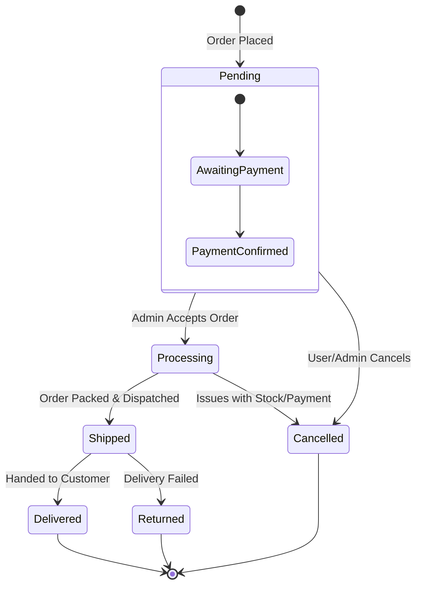
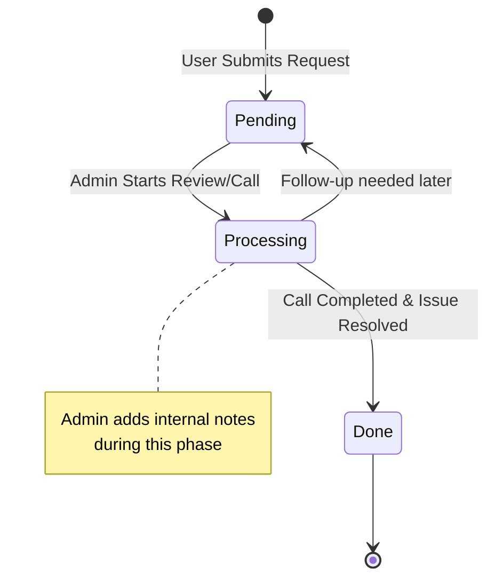

# State Diagrams - Craft Royale

This document defines the lifecycle and state transitions of key entities within the Craft Royale platform.

## 1. Order Lifecycle State Diagram
This diagram shows the transition of an order from creation to fulfillment or cancellation.

---

## 2. Callback Request State Diagram
This illustrates the states of a support callback request as it is handled by the admin team.

---

## Main State Transitions

### 1. Order Management
- **Pending**: Initial state after a data record is created in `orders` table.
- **Processing**: The active phase where inventory is prepared.
- **Shipped/Delivered**: The logistical completion of the transaction.
- **Cancelled**: Terminal state for unsuccessful orders.

### 2. Support Management (Callbacks)
- **Pending**: The request is visible in the admin feed but hasn't been addressed.
- **Processing**: The support representative is actively attempting to contact the user or researching the query.
- **Done**: The conversation is closed, and the user's inquiry is resolved.

---
**Note:** These state diagrams provide the logic for the `status` column values found in the `orders` and `callback_requests` database tables.
