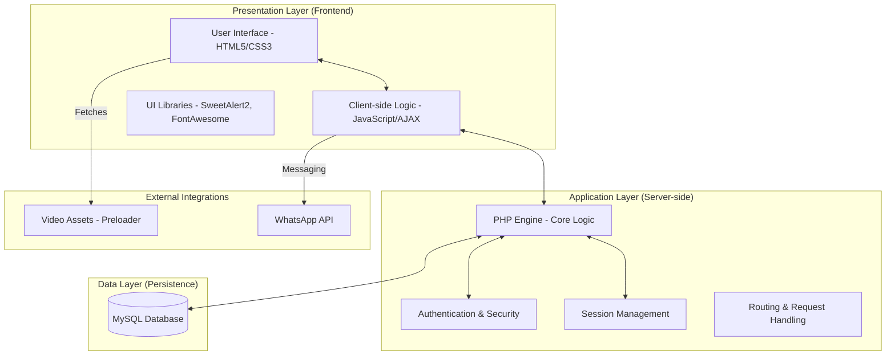

# System Architecture - Craft Royale

This document describes the structural design and technology stack of the Craft Royale E-commerce platform.

## 3-Tier Architecture Diagram

The system follows a classic 3-tier architecture to ensure separation of concerns between user interface, logic, and data storage.

---

## Technology Stack

| Layer | Technologies Used | Purpose |
|-------|-------------------|---------|
| **Frontend** | HTML5, CSS3 (Vanilla), JavaScript | Structure, Styling, and Interactivity |
| **Styling** | Google Fonts, Glassmorphism, CSS Gradients | Premium visual aesthetics |
| **Backend** | PHP 7.4+ | Server-side processing and business logic |
| **Database** | MySQL (XAMPP) | Relational data persistence |
| **Security** | MySQLi Prepared Statements, Session Validation | Protecting user data and admin access |
| **Communication** | AJAX (Fetch API) | Seamless data updates without page refresh |

---

## Architectural Components

### 1. Presentation Layer
- **Responsiveness**: Modern CSS ensures the site works across Desktop and Mobile.
- **Micro-animations**: Uses SVG/CSS animations and Video preloaders for premium UX.
- **Dynamic Content**: AJAX is used for Cart updates and Callback requests to provide a "Single Page App" feel in specific modules.

### 2. Application Layer (PHP)
- **State Management**: PHP `$_SESSION` manages user logins and temporary shopping cart data.
- **Business Logic**: Handles inventory deduction, price calculations, and receipt generation.
- **Admin Interface**: A separate secure module for store management.

### 3. Data Layer (Relational)
- **MySQL**: Optimized for transactional integrity (ACID properties), ensuring orders and inventory are always in sync.
- **Relational Mapping**: Tables are linked via Primary/Foreign keys to prevent data redundancy.

---
**Note:** This architecture is designed for scalability and ease of deployment on standard Apache/XAMPP environments.
