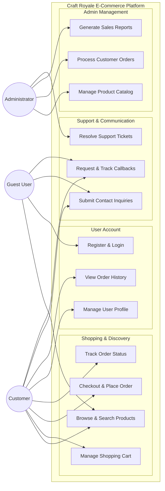

# Simplified Use Case Diagram - Craft Royale

This document provides a high-level overview of the main functional topics of the Craft Royale E-commerce platform.

## High-Level Use Case Diagram

---

## Main Functional Topics

### 1. Shopping & Discovery
The core e-commerce flow allowing users to find products, manage their cart, and securely place orders.

### 2. User Account
Personalized features for registered users to manage their profiles, identities, and see their past activity.

### 3. Admin Management
Deep-level control for store owners to manage inventory, fulfill orders, and monitor business performance.

### 4. Support & Communication
Direct channels for customers to get help through contact forms and the new callback request system.

---
**Note:** This is a simplified view intended for university reports and high-level architectural overviews.
